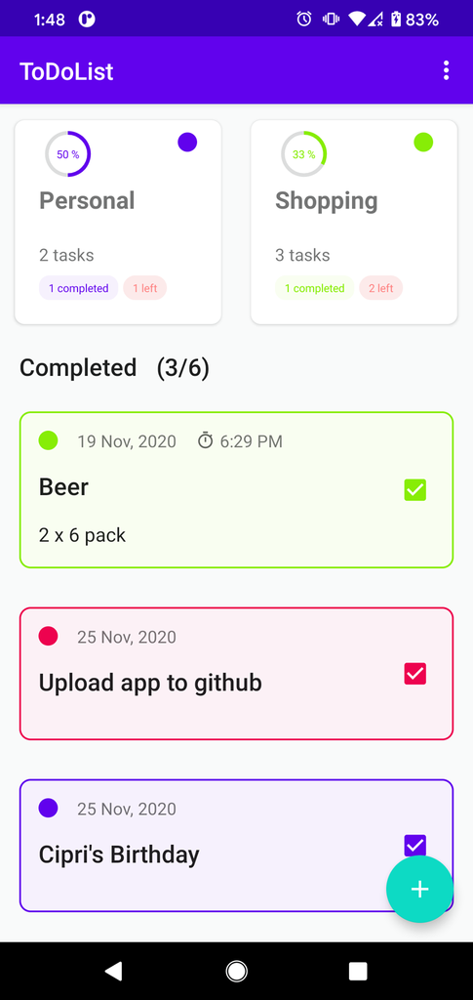
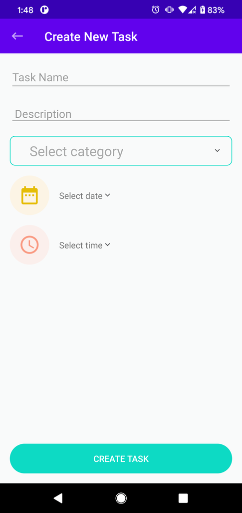
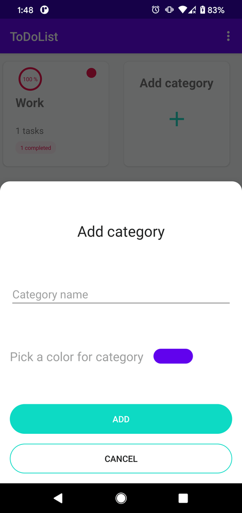

## ToDoList - simple Android app to add tasks grouped in categories

* MVVM architecture
* Room + LiveData + Coroutines
* DataBinding
* Dagger-Hilt dependency injection
* Shared Preferences

## Screenshots

  

